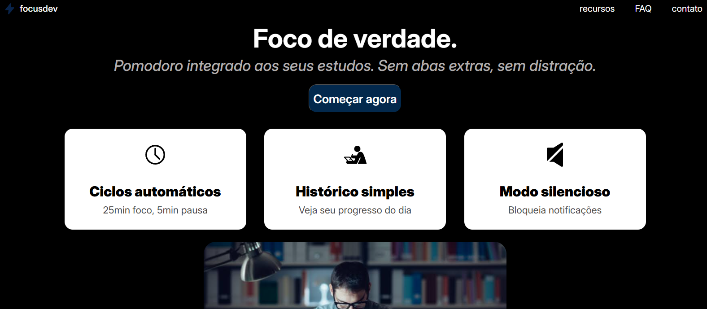

# ⚡ focusdev

Landing page interativa para um SaaS fictício de produtividade voltado a devs e estudantes — um app de ciclos Pomodoro que ajuda a manter o foco durante sessões de estudo ou programação.

Projeto construído como integrador dos conceitos de **JavaScript vanilla** (DOM, eventos, manipulação de classes) aprendidos no curso, sem uso de frameworks ou bibliotecas.

> Deploy ainda não realizado.

## 🛠️ Tecnologias

- HTML5 semântico
- CSS3 (Flexbox)
- JavaScript (ES6+) — manipulação de DOM, eventos, `classList`, closures
